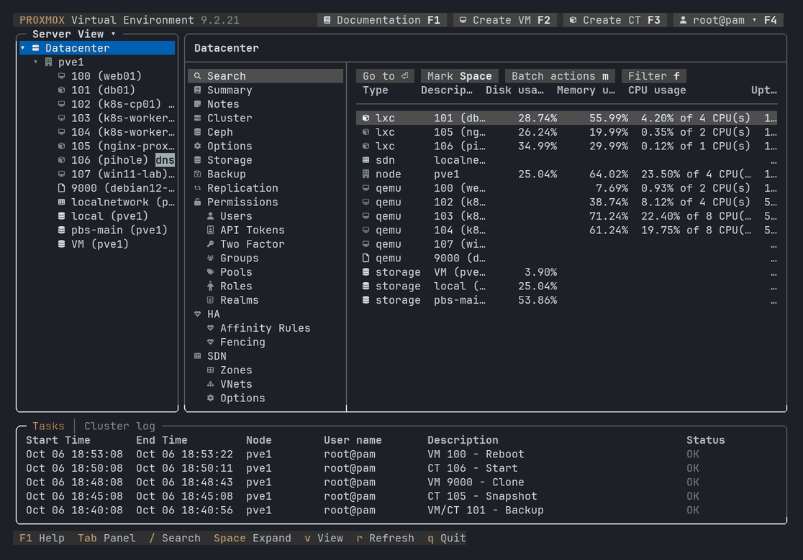

# Proxhawk-tui — una consola de texto para Proxmox VE

[English](README.md) | [Français](README.fr.md) | **Español** | [Deutsch](README.de.md) | [简体中文](README.zh-CN.md) | [Русский](README.ru.md)

Versión 2.1.0 · licencia AGPL-3.0-or-later

`proxhawk-tui` es una versión en modo texto de la interfaz web de Proxmox VE
(la GUI servida en el puerto 8006). Reproduce su disposición, su navegación y
la mayoría de sus paneles con marcos Unicode, gráficos en braille, iconos
Nerd Font y colores ANSI, y no necesita nada que no esté ya instalado en un
nodo Proxmox VE.



*Datos de demostración.*

## Puntos destacados

- **La misma disposición y los mismos menús que la interfaz web**
  (comprobados con las definiciones de menús de Proxmox VE 9): barra de
  cabecera, árbol de recursos (vistas Servidor / Carpeta / Pool /
  Almacenamiento), menú de navegación por objeto, barra de herramientas,
  panel de contenido y panel *Tareas / Registro del clúster*.
- **Lectura y escritura**: cada tabla de configuración ofrece
  *Agregar / Editar / Eliminar* (`a` / `e` / `d`). Los diálogos se **generan
  a partir del esquema de la API** de la llamada que realizan: ofrecen los
  mismos parámetros, opciones y valores predeterminados que los diálogos de
  la GUI, incluidas las cadenas de propiedades (`net0`, `scsi0`,
  `rootfs`...) editadas en subformularios.
- **Toda la GUI**: Centro de datos (clúster, opciones, almacenamientos de
  todo tipo, trabajos de copia de seguridad, replicación, permisos,
  usuarios, tokens de API, 2FA, grupos, pools, roles, dominios, HA y reglas
  de afinidad, SDN con zonas, VNets, subredes, controladores, IPAM, DNS,
  firewall de VNets, fabrics, route maps, listas de prefijos, ACME,
  firewall, servidores de métricas, asignaciones de recursos y de
  directorios, modelos de CPU personalizados, notificaciones), Nodo (red con
  aplicar/revertir, certificados y pedidos ACME, DNS, hosts, hora,
  servicios, actualizaciones, repositorios, discos con GPT/borrado, LVM,
  LVM-Thin, Directorio, ZFS, **Ceph** con asistente de instalación,
  monitores, OSD, CephFS, pools), VM y contenedores (hardware/recursos,
  cloud-init, opciones, instantáneas, copias de seguridad, restauración,
  firewall, permisos, HA, clonado, plantilla, migración).
- **Consola**: `qm terminal` para las VM con puerto serie, **SSH para las VM
  Linux sin puerto serie** (IP encontrada por el agente invitado, la tabla
  de vecinos o un escaneo de la red del puente), `pct enter` para los
  contenedores, shell del nodo.
- **Huella mínima**: bash puro + el Perl y `pvesh` incluidos en Proxmox VE.
  `whiptail` (también incluido) o `dialog` para los diálogos. Sin demonio,
  sin dependencias, nada escrito fuera de `~/.config/proxhawk-tui` y de un
  directorio temporal.
- **Rápido**: un pequeño asistente Perl persistente carga la API una sola
  vez y responde en milisegundos, en lugar de lanzar `pvesh` (1–2 s) en cada
  lectura.
- **Probado**: `tools/integration-test.sh` recorre cada panel y cada acción
  en un nodo real y verifica cada escritura a través de la API (ver
  [docs/TESTING.md](docs/TESTING.md)).
- **Modular**: cada panel es una pequeña función en `views/`; los temas,
  conjuntos de iconos e idiomas son archivos simples.
- **Teclado y ratón**, 256 colores, truecolor u 8 colores, iconos Nerd
  Font, Unicode, ASCII puro o sin iconos. Atajos de teclado y colores
  configurables; diez temas (Dracula, Nord, Gruvbox, Catppuccin, Tokyo
  Night...).
- **34 idiomas**: inglés, francés, español, alemán, chino simplificado y
  ruso completos; los demás idiomas de la GUI gracias al catálogo oficial de
  Proxmox VE instalado en el nodo (las mismas palabras que la GUI). Ver
  [docs/I18N.md](docs/I18N.md).
- **Acciones en lote y cola**: marque invitados con `Espacio` en las
  rejillas de búsqueda para iniciarlos, detenerlos o respaldarlos juntos;
  las acciones sobre un invitado ocupado se ponen en cola.
- **Programable**: `proxhawk-tui guests list -o table`,
  `proxhawk-tui guests start 101`, `proxhawk-tui api get /version`...
  (salida JSON o tabla, ver [docs/CLI.md](docs/CLI.md)).
- **Plugins**: entradas de menú opcionales (instalador de los
  community-scripts, inventario de Ansible) — ver
  [docs/EXTENDING.md](docs/EXTENDING.md#plugins).

## Requisitos

| Componente | Notas |
|-----------|-------|
| Nodo Proxmox VE 7, 8 o 9 | ejecutar como `root` en el nodo, directamente o con `sudo` (ver [Quién puede ejecutarlo](#quién-puede-ejecutarlo)) |
| bash ≥ 4.3 | estándar |
| perl + módulos Perl de PVE | incluidos con Proxmox VE |
| `whiptail` o `dialog` | `whiptail` se instala por defecto; si no, avisos integrados |
| `less` | opcional, para mostrar los registros |
| Un terminal UTF-8, ≥ 80×18 | se recomiendan 256 colores; una Nerd Font para los iconos originales |

## Instalación

### En una línea (paquete de la última versión)

En un nodo Proxmox VE, como root (o con `sudo`), una línea instala la última
versión (el `.deb` se verifica con su suma SHA-256 antes de que `apt` lo
instale):

```bash
bash -c "$(curl -fsSL https://raw.githubusercontent.com/Mrdindon/proxhawk-tui/main/install.sh)"
proxhawk-tui
```

Con sudo: `sudo bash -c "$(curl -fsSL https://raw.githubusercontent.com/Mrdindon/proxhawk-tui/main/install.sh)"`,
luego `sudo proxhawk-tui`.

Desinstalar: `apt remove proxhawk-tui`. Puede leer
[install.sh](install.sh) antes de ejecutarlo; los paquetes también están en
la [página de releases](https://github.com/Mrdindon/proxhawk-tui/releases).

### Con git clone

La rama `main` contiene las versiones publicadas (tags `vX.Y.Z`); `develop`
es el trabajo en curso.

```bash
apt install git            # si git aún no está instalado
git clone https://github.com/Mrdindon/proxhawk-tui.git /opt/proxhawk-tui
cd /opt/proxhawk-tui
./proxhawk-tui             # ejecutar en el sitio, o:
./install.sh               # comando "proxhawk-tui" (enlace en /usr/local/bin)
```

- **Actualizar**: `proxhawk-tui upgrade` (ver [Actualización](#actualización)).
- **Una versión concreta**: `git checkout vX.Y.Z` (volver a la última: `git checkout main`).
- **Desinstalar**: `./install.sh --uninstall` y luego borrar el directorio.
- Sirve cualquier directorio; `./install.sh --prefix DIR` coloca el comando
  en otro lugar que `/usr/local/bin`.
- No mezcle los dos métodos: quite el paquete (`apt remove proxhawk-tui`)
  antes de usar un clon, o al revés.

### Actualización

```bash
proxhawk-tui upgrade --check    # ¿hay una versión nueva? (código de salida 10 si la hay)
proxhawk-tui upgrade            # actualizar (pide confirmación; --yes para evitarlo)
```

`upgrade` detecta cómo se instaló proxhawk-tui:

| Instalado con | Qué hace `upgrade` |
|---|---|
| la línea de instalación (paquete `.deb`) | descarga el `.deb` de la última versión, verifica su suma SHA-256 y lo instala con `apt` (como root o con `sudo`) |
| `git clone` | `git fetch`, muestra la nueva versión y sus commits, y luego `git pull --ff-only` de la rama actual (se niega si hay cambios locales) |
| un archivo comprimido descomprimido a mano | indica la versión disponible y cómo instalarla |

`--version X.Y.Z` instala una versión concreta (paquete). Volver a ejecutar
la línea de instalación también actualiza el paquete.

### Quién puede ejecutarlo

proxhawk-tui usa directamente la pila local de la API de Proxmox VE, como
`pvesh` (sin HTTP, sin ticket): en el nodo debe ejecutarse como **root**,
directamente o con `sudo`. Los **permisos de Proxmox VE** son un nivel
aparte: al iniciar, proxhawk-tui pregunta con qué usuario de Proxmox VE
actuar (`root@pam`, `alice@pve`...), y se aplican los permisos de ese
usuario, como en la GUI (ver
[Running as another user](docs/CONFIGURATION.md#running-as-another-user)).
Ejecutar proxhawk-tui desde una cuenta Linux que no sea root requeriría la
API por HTTPS con un token: aún no es posible.

Opciones útiles:

```bash
proxhawk-tui --glyphs nerd       # iconos Font Awesome de la GUI (requiere una Nerd Font
                                 # en SU terminal, ver docs/CONFIGURATION.md)
proxhawk-tui --theme dark        # aspecto «Proxmox Dark»
proxhawk-tui --lang es           # idioma de la interfaz (por defecto: automático)
proxhawk-tui --select qemu/100   # abrir directamente en la VM 100
proxhawk-tui --backend pvesh     # no usar el asistente de API persistente
```

## Teclas esenciales

| Tecla | Acción |
|-----|--------|
| `↑` `↓` / `j` `k`, `PgUp` `PgDn`, `Home` `End` | moverse en el panel activo |
| `Tab` / `Shift+Tab` | panel siguiente / anterior (árbol → menú → contenido → tareas) |
| `←` `→` | contraer / expandir en el árbol, pasar de un panel a otro |
| `Intro` | abrir / actuar sobre la fila seleccionada |
| `/` | buscar recursos |
| `v` | cambiar la vista del árbol (Servidor, Carpeta, Pool, Almacenamiento) |
| `a` `e` `d` | Agregar, Editar, Eliminar en las tablas de configuración |
| `s` `h` `c` `H` `m` | Iniciar, menú Apagar, Consola, SSH, Más (invitados) |
| `b` `h` `S` `B` | Reiniciar, Apagar, Shell, Acciones masivas (nodos) |
| `t` | cambiar el periodo de los gráficos en los resúmenes |
| `l` | alternar *Tareas* / *Registro del clúster* |
| `r` / `F5` | actualizar |
| `F1` / `?` | ventana de ayuda: teclas del panel actual |
| `F2` `F3` `F4` | botones de la cabecera: Crear VM, Crear CT, menú de usuario (ajustes, iconos, idioma...) |
| `Espacio` `m` `f` | marcar un invitado, acciones en lote, filtro (rejillas de búsqueda) |
| `w` | URL de la consola del navegador (noVNC / xterm.js) de un invitado o de un nodo |
| `F6` | pausar / reanudar la actualización automática |
| `q` / `F10` | salir |

La lista completa está en [docs/USAGE.md](docs/USAGE.md).

## Documentación

La documentación detallada está en inglés.

| Documento | Contenido |
|----------|---------|
| [docs/USAGE.md](docs/USAGE.md) | guía de usuario: pantalla, navegación, cada panel y cada acción |
| [docs/CONFIGURATION.md](docs/CONFIGURATION.md) | archivo de configuración, atajos, colores, línea de comandos, plugins, temas, conjuntos de iconos |
| [docs/CLI.md](docs/CLI.md) | comandos no interactivos (JSON / tabla) |
| [docs/ARCHITECTURE.md](docs/ARCHITECTURE.md) | módulos, flujo de datos, protocolo del asistente de API, renderizado |
| [docs/EXTENDING.md](docs/EXTENDING.md) | agregar un panel, una acción, un tema o un conjunto de iconos |
| [docs/I18N.md](docs/I18N.md) | idiomas, traducciones, agregar un idioma |
| [docs/TESTING.md](docs/TESTING.md) | lint, autoprueba, pruebas de pantalla, pruebas de integración de lectura/escritura |
| [AGENTS.md](AGENTS.md) | guía breve para agentes de programación |
| [docs/DEVELOPMENT.md](docs/DEVELOPMENT.md) | notas internas: decisiones de diseño, comportamientos de Proxmox VE, procedimiento de publicación |
| [CHANGELOG.md](CHANGELOG.md) | versiones |
| [docs/COMPARISON-devnullvoid-pvetui.md](docs/COMPARISON-devnullvoid-pvetui.md) | análisis de devnullvoid/pvetui e ideas de mejora |

## Organización del proyecto

```
proxhawk-tui     punto de entrada (argumentos, bucle principal, teclado/ratón)
install.sh       instalación / desinstalación (paquete desde GitHub, o enlace)
lib/             módulos (terminal, API, widgets, disposición, acciones...)
lib/broker.pl    asistente de API persistente (Perl, módulos PVE)
views/           un archivo por tipo de objeto (datacenter, node, qemu, lxc...)
themes/          temas de colores
plugins/         plugins opcionales (se activan en F4 > Plugins)
lang/            idiomas (en, fr, es, de, zh_CN, ru + TEMPLATE.sh)
conf/            configuración de ejemplo
tests/screens/   escenarios de las pruebas de pantalla, respuestas de API grabadas, pantallas de referencia
tools/           lint.sh, selftest.sh, screen-test.sh, integration-test.sh,
                 i18n-extract.sh, i18n-check.sh, make-release.sh, make-deb.sh
docs/            documentación
```

## Limitaciones

- Las consolas gráficas (noVNC, SPICE) no se pueden mostrar en un terminal:
  se usan en su lugar la consola serie, SSH o `pct enter` (`w` da la URL de
  la consola noVNC para el navegador).
- Funciona solo en un nodo del clúster (todavía sin conexión remota a la
  API).
- proxhawk-tui se ejecuta como `root` en un nodo del clúster (directamente o
  con `sudo`): usa directamente la pila local de la API (sin HTTP, sin
  ticket), exactamente como `pvesh`; los permisos de Proxmox VE aplicados
  son los del usuario elegido al iniciar.
- Las subidas (ISO, plantillas, snippets) toman un archivo del propio nodo.

## Cómo se hizo

proxhawk-tui se escribió con [Claude Code](https://claude.com/claude-code),
el agente de programación de Anthropic, dirigido y revisado por el autor, y
probado en un nodo Proxmox VE real (ver [docs/TESTING.md](docs/TESTING.md)).
Las notas de diseño y las lecciones aprendidas están en
[docs/DEVELOPMENT.md](docs/DEVELOPMENT.md); [AGENTS.md](AGENTS.md) es la guía
que se da a los agentes de programación que trabajan en él.

## Licencia y nombre

proxhawk-tui es software libre bajo la **Licencia Pública General Affero de
GNU v3.0 o posterior** (ver [LICENSE](LICENSE)), la licencia del propio
Proxmox VE, cuyos módulos Perl carga el asistente de API.

Proxmox® es una marca registrada de Proxmox Server Solutions GmbH.
proxhawk-tui es un proyecto independiente, no afiliado a Proxmox Server
Solutions GmbH ni respaldado por ella. Se llamó *pvetui* (1.0 – 1.1) y
luego *pvetty* (1.2 – 1.3); los ajustes de esas versiones se migran
automáticamente.
